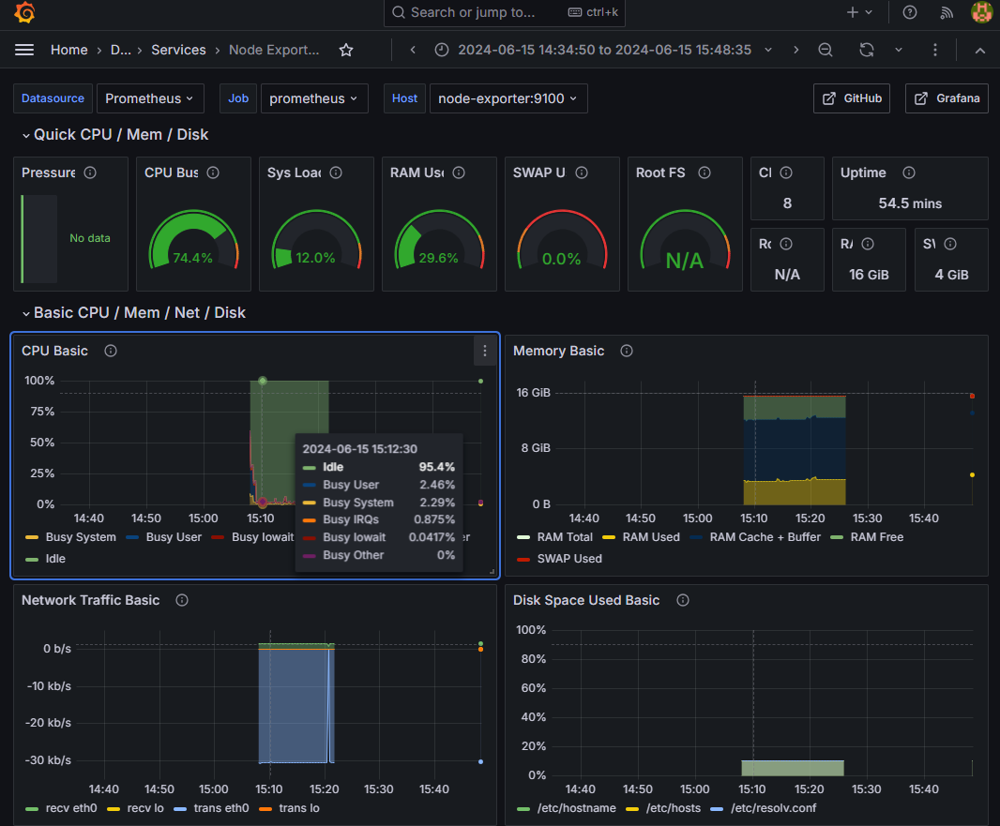
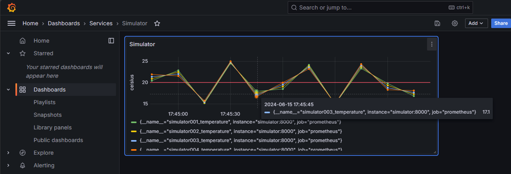

# grafana-prometheus

Grafana と Prometheus を使用して、IoT デバイスのメトリクスを収集・可視化する監視サービスを構築します。

## 事前条件

- [Docker](https://www.docker.com/products/docker-desktop/)

## アーキテクチャ図

[](./architecture.png)

## 利用方法

ローカル環境で Docker Compose を使用して、IoT デバイスのメトリクスを収集・可視化する監視サービスを構築します。
サービスは [compose.yaml](../../compose.yaml) で定義されており、各サービスの設定は [configs](../../configs) ディレクトリにあります。

| サービス      | 概要                                       |
| ------------- | ------------------------------------------ |
| Grafana       | メトリクスを可視化するダッシュボード       |
| Prometheus    | メトリクスを収集するための監視サービス     |
| Node Exporter | ノードのメトリクスを収集するエージェント   |
| Alertmanager  | アラートを通知するための監視サービス       |
| Simulator     | 仮想デバイスをシミュレートするエージェント |

以下のコマンドでローカル環境に監視サービスを構築します。

```shell
# ソースコードを取得して、リポジトリに移動します
git clone https://github.com/ks6088ts-labs/iot-monitoring.git
cd iot-monitoring

# Docker Compose で監視サービスを構築します
docker compose up -d
```

http://localhost:3000 にアクセスし、Grafana にログインします。
初回ログイン時のユーザ名とパスワードはどちらも `admin` です。
パスワードを変更する画面が表示されるので、新しいパスワードを設定してください。

ログイン後、Grafana のホームから Dashboards > Services > Node Exporter Full を開くと、node-exporter のメトリクスが表示されます。

[](./node-exporter-full.png)

Dashboards > Services > Simulator を開くと、simulator のメトリクスが表示されます。

[](./simulator.png)

## カスタム方法

### 通知設定

#### Slack

[Slack の Incoming Webhooks](https://api.slack.com/messaging/webhooks) を使用して、アラートを通知します。Slack の Webhook URL を払い出し、[alertmanager.yml](../../configs/alertmanager/alertmanager.yml) の `slack_api_url` に設定します。

#### Microsoft Teams

(FIXME: Microsoft Teams に通知する方法を追記します。)

### アラート通知を編集する

アラートは Alertmanager の [alert_rules.yml](./configs/prometheus/alert_rules.yml) で定義されており、以下のルールが設定されています。

- InstanceDown: 一定時間以上メトリクスが収集されない場合
- APIHighRequestLatency: API のレイテンシが一定時間以上閾値を超えた場合

[Alertmanager の Configuration 設定ドキュメント](https://prometheus.io/docs/alerting/latest/configuration/) を参考に、アラートのルールを編集します。

#### ノードのメトリクスを変化させてみる

アラートをテストするため、Node Exporter のメトリクスを変化させます。
以下のコマンドで CPU 使用率を上げ、メトリクスの変化を確認します。

```shell
# Node Exporter のコンテナにログインします
docker compose exec node-exporter sh

# メトリクスを変化させるために CPU 負荷をかけます。
yes > /dev/null &

# PID を確認して kill して後片付けをします
ps
kill <PID0>
```

#### アラートをテストする

InstanceDown のアラートを発生させるため、以下のコマンドで Node Exporter を停止します。

```shell
# Node Exporter のコンテナにログインします
docker compose exec node-exporter sh

# Node Exporter を停止します
docker compose stop node-exporter
```

一定時間後にアラートが発生します。

### Exporter を実装する

Node Exporter 以外のメトリクスを収集するため、Exporter を実装します。
Exporter は Prometheus に対してメトリクスを提供する HTTP サーバーです。
Exporter の実装方法は [Prometheus の Exporter 開発ガイド](https://prometheus.io/docs/instrumenting/writing_exporters/) を参考にしてください。

サンプルコードとして、[Simulator](../../cmds/prometheus/simulator.py) を実装しています。
Simulator は時変動するメトリクスを提供する HTTP サーバーです。

## 参考文献

### Prometheus

- [What is Prometheus?](https://prometheus.io/docs/introduction/overview/)
- [ALERTING RULES](https://prometheus.io/docs/prometheus/latest/configuration/alerting_rules/#alerting-rules)
- [Monitor your home's temperature and humidity with Raspberry Pis and Prometheus](https://opensource.com/article/21/7/home-temperature-raspberry-pi-prometheus)

### Grafana

- [Grafana > Data sources > Prometheus](https://grafana.com/docs/grafana/latest/datasources/prometheus/)
- [Grafana で Dashboard と DataSource の設定をファイルで管理する[Configuration as Code]](https://zenn.dev/ring_belle/articles/grafana-cac-docker)
- [Prometheus + Node_exporter + Grafana でシステム管理](https://qiita.com/Charon9/items/09745a2ca1279045f10f)
- [All dashboards > Node Exporter Full](https://grafana.com/grafana/dashboards/1860-node-exporter-full/)
- [node-exporter-full.json](https://raw.githubusercontent.com/rfmoz/grafana-dashboards/master/prometheus/node-exporter-full.json)
- [Grafana のダッシュボードをエクスポート/インポートしてみた](https://dev.classmethod.jp/articles/export-and-import-grafana-dashboard/)
