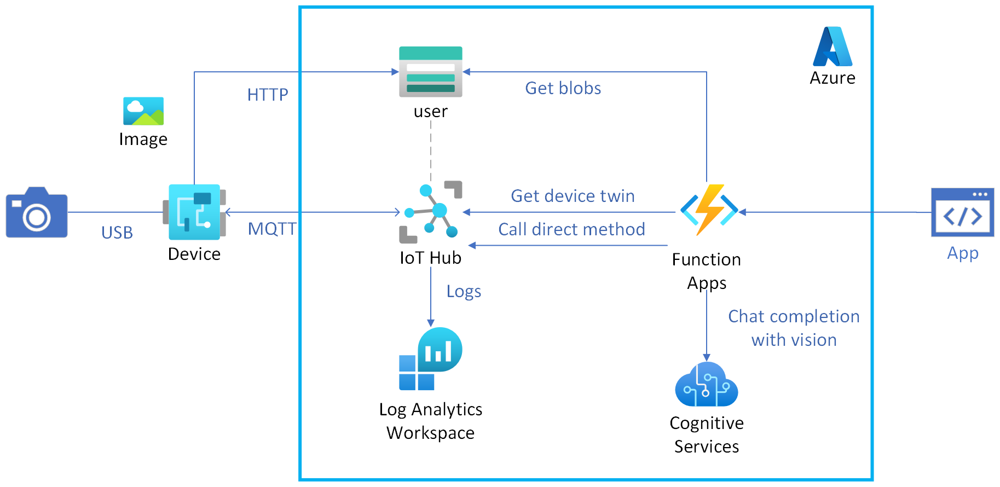

# iot-hub-messaging

Azure IoT Hub を使用して、IoT デバイスとクラウド間でメッセージの送受信を行います。

## 環境構築

```shell
git clone git@github.com:ks6088ts-labs/azure-ai-services-solutions.git
cd azure-ai-services-solutions/infra

# デプロイ
make deploy
```

Azure IoT Hub を経由して Azure Blob Storage にファイルアップロードするために、Azure IoT Hub と Azure Storage Account を関連付ける必要があります。以下の記事を参考に設定してください。

- [Azure IoT Hub を使用してデバイスからクラウドにファイルをアップロードする (Python) > IoT Hub への Azure Storage アカウントの関連付け](https://learn.microsoft.com/ja-jp/azure/iot-hub/file-upload-python#associate-an-azure-storage-account-to-iot-hub)
- [IoTHub を経由して Blob Storage にファイルをアップロードするメモ for Python3](https://zenn.dev/tmitsuoka0423/articles/iothub-file-upload-python)

## アーキテクチャ図

[](./architecture.png)

## ユーザーストーリー

- ユーザーは、IoT デバイスにコマンドを発行できる (Direct Method)
- ユーザーは、IoT デバイスの状態を取得できる (Device Twin)
- ユーザーは、IoT デバイスが撮影した画像を取得できる (Blob Storage)

## スクリプト実行 demo

- [Samples for the Azure IoT Hub Device SDK](https://github.com/Azure/azure-iot-sdk-python/blob/main/samples/README.md)

```shell
# 環境変数設定
cp .env.sample .env
```

```shell
# Help
poetry run python main.py --help

# 1. send-message
poetry run python main.py send-message

# 2. receive-direct-method
poetry run python main.py receive-direct-method
# Azure Portal から該当デバイスに対して direct method を送信

# 3. upload-to-blob
poetry run python main.py upload-to-blob --blob-name YYYYMMDD_HHMMSS.jpg
```

# References

- [Monitoring Azure IoT Hub](https://learn.microsoft.com/en-us/azure/iot-hub/monitor-iot-hub)
